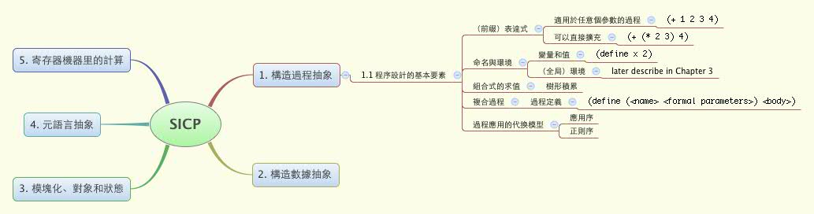

SICP
---

Stucture and Interpretation of Computer Programs

## Introduction

This is my exercise of SICP written in [Racket](http://racket-lang.org).

I use DrRacket to do the exercise.

Follow these [instruction](http://www.neilvandyke.org/racket-sicp/) to complete the installation.

## Note

Recently, I use markdown to make notes about the book which are in the Chapter* folders. 

(see the README file in each folder)

## MindMap

Generated by [XMind](http://xmind.net)

## License

The MIT License